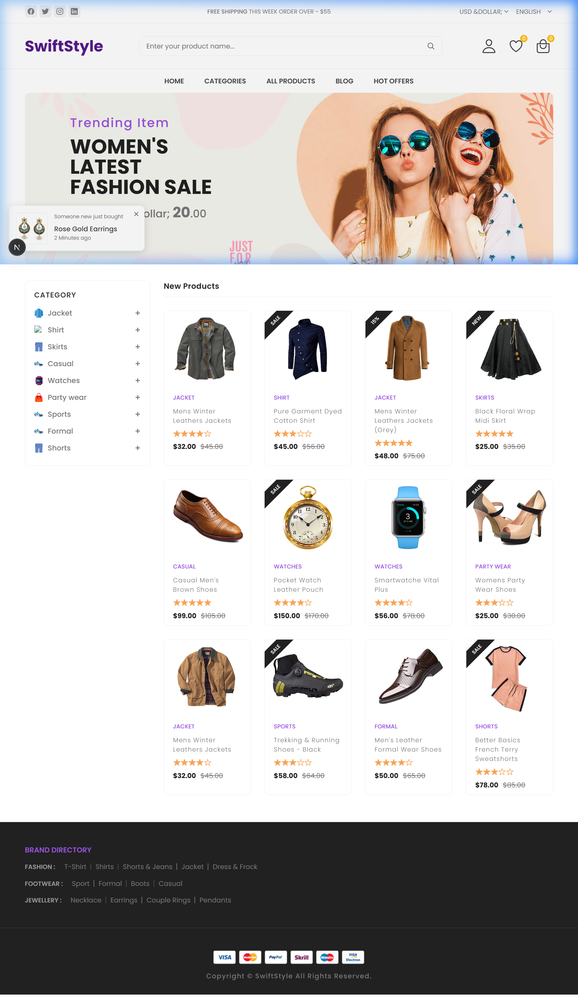
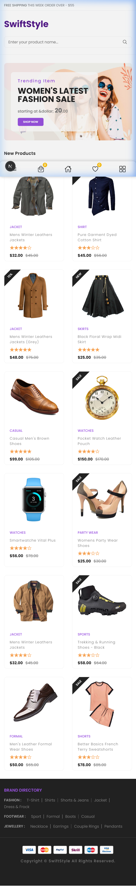

# SwiftStyle 🛍️

SwiftStyle is a premium, modern, and fully responsive eCommerce web application built with **Next.js**. It features a sleek, minimalist design tailored for a high-end shopping experience, complete with dynamic product listings, category filtering, and a seamless user interface.



## ✨ Features

- **�️ Interactive Shopping Experience**: Dynamic cart management with a slide-out sidebar for a seamless checkout flow.
- **📱 Fully Responsive Design**: Optimized for all devices, from large desktops to mobile phones, ensuring a consistent look and feel.
- **✨ Hero Slider**: Visually stunning promotional banners featuring the latest trending items and sales.
- **📦 Interactive Product Grid**: Dynamic product display with hover effects and real-time "Add to Cart" functionality.
- **🔍 Advanced Category Filtering**: Easily navigate through various categories like Jackets, Shirts, Skirts, Watches, and more via an intuitive sidebar.
- **📰 Smart Newsletter Integration**: Engage users with an elegant newsletter subscription modal.
- **🔔 Real-time Notifications**: Custom toast notifications for actions like "Added to Cart" to improve user engagement.
- **📂 Data-Driven Architecture**: Easily manageable product, category, and blog data using JSON-based configurations.
- **🎨 Premium UI/UX**: Built with a focus on modern aesthetics, featuring smooth transitions, hover effects, and a glass-morphism header.

## 📱 Mobile Preview

<p align="center">
  
</p>

## 🚀 Tech Stack

- **Framework**: [Next.js](https://nextjs.org/) (App Router)
- **Library**: [React](https://reactjs.org/)
- **Styling**: Vanilla CSS with CSS Modules
- **Icons**: [React IonIcons](https://www.npmjs.com/package/react-ionicons)
- **Fonts**: Geist (Optimized via `next/font`)

## 🛠️ Project Structure

```text
SwiftStyle/
├── app/                # Next.js App Router pages and layouts
├── components/         # Reusable UI components (Header, Footer, Cart, etc.)
├── data/               # JSON data files for products, categories, and blogs
├── public/             # Static assets (Images, Icons)
├── website-demo-image/ # Project screenshots for documentation
└── styles/             # Global and modular CSS files
```

## 🏁 Getting Started

To get a local copy up and running, follow these simple steps:

### Prerequisites

Make sure you have Node.js and npm installed on your machine.

### Installation

1. Clone the repository:
   ```bash
   git clone https://github.com/your-username/SwiftStyle.git
   ```
2. Navigate to the project directory:
   ```bash
   cd SwiftStyle
   ```
3. Install dependencies:
   ```bash
   npm install
   ```

### Running Locally

Start the development server:
```bash
npm run dev
```

Open [http://localhost:3000](http://localhost:3000) with your browser to see the result.

## 🤝 Contributing

Contributions are what make the open-source community such an amazing place to learn, inspire, and create. Any contributions you make are **greatly appreciated**.

1. Fork the Project
2. Create your Feature Branch (`git checkout -b feature/AmazingFeature`)
3. Commit your Changes (`git commit -m 'Add some AmazingFeature'`)
4. Push to the Branch (`git push origin feature/AmazingFeature`)
5. Open a Pull Request

---

Developed with ❤️ by the SwiftStyle Team.
